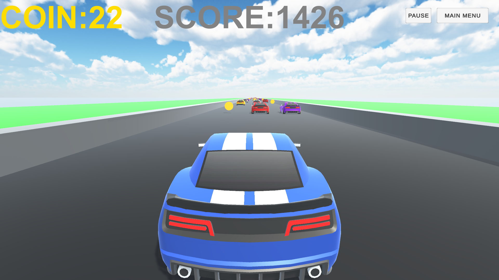
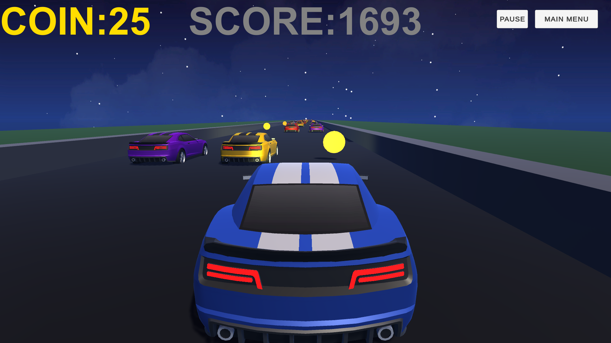

<h1 align="center">Step On The Gas</h1>

<p align="center">
A 3D arcade driving game developed with Unity and C#.<br>
Drive through a long obstacle course, avoid barriers, collect coins, switch camera views, and play in day or night mode.
</p>

<p align="center">
  
  
  
  
  
  
  
  
</p>

---

## Project Overview

**Step On The Gas** is a 3D arcade driving game where the player controls a car on a forward-moving road and tries to survive as long as possible while collecting coins and avoiding barriers.

The game is built around a simple driving loop:

- steer left and right,
- stay inside the road boundaries,
- collect coins placed along the route,
- avoid barriers and road hazards,
- increase score over time,
- retry quickly after crashing,
- choose between day and night gameplay scenes.

The project also includes a main menu, controls screen, settings screen, audio feedback, camera switching, headlight control, and pause/restart actions.

## Screenshots

### Day Mode



### Night Mode



---

## Supported Platform

Step On The Gas is currently organized as a **PC Unity project**.

- Keyboard input is used for gameplay.
- The project can be opened directly from the repository root in Unity Hub.
- Compiled builds are not stored in the source repository.

---

## Project Structure

```text
Step_On_The_Gas/
|-- Assets/
|   |-- ARCADE - FREE Racing Car/
|   |-- codes/
|   |   |-- carcode.cs
|   |   |-- textcoin.cs
|   |   `-- textscore.cs
|   |-- colors/
|   |-- Music Tracks/
|   |-- prefabs/
|   |-- Scenes/
|   |   |-- mainmenu.unity
|   |   |-- game.unity
|   |   |-- nightgame.unity
|   |   |-- controls.unity
|   |   `-- settings.unity
|   |-- screenshots/
|   |   |-- day-mode.png
|   |   `-- night-mode.png
|   |-- Score and Times - Game Sound Solutions/
|   |-- Skybox/
|   |-- steponthegasicon.png
|   `-- TextMesh Pro/
|-- Packages/
|   |-- manifest.json
|   `-- packages-lock.json
|-- ProjectSettings/
|-- LICENSE
|-- README.md
`-- .gitignore
```

Unity-generated folders such as `Library`, `Logs`, `UserSettings`, and `obj` are intentionally ignored by Git.

---

## Core Systems

### Vehicle Movement

- The car moves forward automatically during gameplay.
- The player steers left and right using keyboard input.
- Forward speed changes across distance ranges to create pacing variation.
- Leaving the road boundaries ends the current run.

### Score and Coins

- Score increases continuously while the run is active.
- Coin pickups increase the coin counter.
- The UI displays both score and collected coins during gameplay.
- Some coin interactions reposition road objects or coin groups to extend the route.

### Collision and Retry Flow

- Barrier collisions trigger the crash flow.
- The vehicle stops after a crash or boundary failure.
- The current scene reloads automatically after a short delay.
- The player can also restart manually with the restart input.

### Day and Night Gameplay

- The game includes separate day and night gameplay scenes.
- The main menu can start either mode.
- The night scene supports headlight toggling during gameplay.

### Camera and Interaction

- The player can switch between camera positions during gameplay.
- The car horn can be triggered with keyboard input.
- Pause and resume are available both through input and UI logic.

---

## Features

### Arcade Driving Loop

- Automatic forward motion.
- Left and right steering.
- Road boundary failure condition.
- Fast retry after collisions or falling out of bounds.

### Collectible System

- Coin collection with audio feedback.
- Coin counter displayed in the UI.
- Repositioned collectible patterns that support long-form driving.

### Environment Options

- Day driving scene.
- Night driving scene.
- Toggleable vehicle light in gameplay.
- Skybox and material assets for different visual moods.

### Menu and UI

- Main menu scene.
- Controls scene.
- Settings scene.
- In-game score and coin text.
- Pause, restart, and return-to-menu actions.

### Audio Feedback

- Coin collection sound.
- Crash sound.
- Horn sound.
- Background music assets included in the Unity project.

---

## Game Mechanics

### Steering

The player steers the vehicle horizontally while the car continues moving forward. Steering is applied through Unity's `Rigidbody` physics system.

### Speed Progression

The car's forward speed changes depending on how far it has travelled on the road. This gives the route a more varied rhythm instead of keeping a single fixed speed throughout the entire run.

### Coin Collection

Coins are removed when collected, the coin counter increases, and a collection sound is played. Some special coin patterns also move road or coin objects forward to keep gameplay active across a longer distance.

### Failure Conditions

The run ends when the player hits a barrier or moves outside the road boundaries. After failure, the vehicle stops and the active gameplay scene reloads.

### Scene Navigation

The menu system loads day mode, night mode, controls, and settings scenes. The player can return to the menu from gameplay with the escape input.

---

## How to Play

1. Start the game from the main menu.
2. Choose day mode or night mode.
3. Steer the car left and right to stay on the road.
4. Avoid barriers and road hazards.
5. Collect coins to increase the coin counter.
6. Survive as long as possible and improve your score.

---

## Controls

| Action | Control |
|---|---|
| Move Left | `Left Arrow` or `A` |
| Move Right | `Right Arrow` or `D` |
| Switch Camera | `Space` |
| Toggle Lights | `L` |
| Horn | `Enter` |
| Pause / Resume | `P` |
| Restart Current Scene | `R` |
| Return to Menu | `Esc` |
| Menu Buttons | Mouse click |

---

## Technologies Used

- **Unity Engine 2022.3.4f1** - game development engine.
- **C#** - gameplay, scene navigation, UI counters, and interaction logic.
- **TextMeshPro** - text rendering inside the Unity project.
- **Unity UI (UGUI)** - menu, controls, settings, and gameplay UI.
- **Unity 3D Physics** - Rigidbody-based vehicle movement and collision handling.
- **Unity Audio** - crash, coin collection, horn, and music playback.

---

## Assets and Audio

### Visual Assets

- ARCADE - FREE Racing Car:

https://assetstore.unity.com/packages/3d/vehicles/land/arcade-free-racing-car-161085

- AllSky Free - 10 Sky / Skybox Set:

https://assetstore.unity.com/packages/2d/textures-materials/sky/allsky-free-10-sky-skybox-set-146014

### Audio Assets

- Score and Time:

https://assetstore.unity.com/packages/audio/sound-fx/score-and-time-59255

---

## Installation and Play

1. Clone the repository:

```bash
git clone https://github.com/AFurkanOcel/Step_On_The_Gas.git
```

2. Open the project folder with Unity Hub:

```text
Step_On_The_Gas
```

3. Use **Unity 2022.3.4f1** or a compatible Unity 2022.3 LTS version.

4. Open the main menu scene:

```text
Assets/Scenes/mainmenu.unity
```

5. Press **Play** in the Unity Editor.

### Builds

Compiled builds are not stored in this source repository. Release builds should be distributed through GitHub Releases, itch.io, or another download page.

---

## Credits

### Game Development

**A. Furkan ÖCEL**

---

## License

This project is licensed under the terms included in the repository's `LICENSE` file.
